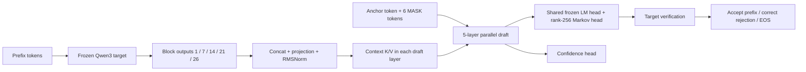

# Qwen3 DSpark

A readable, single-GPU reproduction of the Qwen3 DSpark draft architecture,
with auditable data regeneration, training, and an exact greedy reference verifier.
Based on [NVIDIA NeMo AutoModel](https://docs.nvidia.com/nemo/automodel/recipes-e2e-examples/dspark-speculative-decoding),
pinned to commit `2d365eda1050dd80ee9bd3bfc651e9ae9bbe8c68`.

**Research implementation in progress. No inference speedup has been demonstrated.**
The full-prefix greedy verifier is a correctness reference. Incremental target
and draft caches are also implemented; their native BF16 equality gate has known
failures described below.

A [packed multi-request decoder](docs/packed-sampling.md) and a
[two-step capacity reference](docs/async-capacity.md) now run together on tiny CPU
models, with per-request KV reconstruction and confidence-source checks. A
[bounded trained GPU gate](reports/packed-decoder-gate-20261009/README.md) passed
structural and draft-attention checks; target probability differences remain.
A [full64 native local profile](reports/packed-profile-20261009-700bfa6/README.md)
now records all allocation shapes at two requests and a fixed 128-token context;
its complete-round median is 94.978 ms, excluding real planner/history cost.
A [matched-workload vLLM baseline](reports/vllm-offline-benchmark-20261009-700bfa6/README.md)
measures 127–516 output tok/s across 1/2/4 requests and two prompt lengths.
The [matched native end-to-end run](reports/native-offline-benchmark-20261009-0c36b03/README.md)
completed all 54 batches: 14–36 output tok/s, only 7.1–12.3% of the vLLM
throughput (8.2–14.2 times the batch time). This eager full-shadow baseline has
no capacity scheduler or graphs. It exposes an engine performance gap; it does
not isolate the cost of speculation from the different execution backends.
These are synthetic fixed-output workloads, and target numerical differences
remain unresolved. Measured capacity prediction, graph-backed end-to-end performance
and scheduling overlap remain unfinished. Local verification rounds/s and output tok/s are
different metrics.

A [native graph capability probe](reports/native-capacity-graph-20261009-f5d03d4/README.md)
now passes on real Qwen Q/K/V: fixed-capacity KV tail isolation and three growing
contexts replay through a captured gather+attention subgraph with bit-identical
outputs. This establishes that limited execution boundary; QKV projections,
RoPE, the full model and scheduling overlap are not captured by the probe.

The [full-target graph implementation](docs/persistent-qwen-graph.md) now
includes the original HF model body, persistent KV transactions and explicit
output ownership. Both [speculative](docs/persistent-sampling.md) and
[target-only](docs/packed-target-only.md) sessions have CPU replay-emulator
coverage. All 261 tests passed in the pinned AMD environment with GPUs hidden.
A [pretrained full-target GPU probe](reports/full-target-graph-20261009-3829d53/README.md)
also passed three actual graph replays against same-backend eager execution,
including selected features, all-layer KV, partial commits and rollback. This
finite-shape fidelity result does not resolve cross-backend numerical differences
or demonstrate speedup. The subsequent
[paired R1 end-to-end experiment](reports/paired-r1-benchmark-20261009-192a357/README.md)
completed all 36 batches with 128 output tokens per request. At prompt lengths
64/256, this stack's target-only path measured 44.80/44.18 output tok/s; trained
full-shadow speculative decoding measured 23.10/19.27, or 51.6%/43.6% of that
control. The matched vLLM rates remain 131.26/127.34. Most verification rounds
used actual graphs; eager tails were included in timing. This synthetic workload
shows both a target-stack gap and additional speculation cost, not a speedup.
It does not identify the individual operation responsible for either gap.
The [experiment notebook](docs/lab-notebook.md) preserves the event-ownership,
cancellation and memory-accounting failures found during review and their fixes.

## Architecture



Layer indices are zero-based. Draft queries attend to context strictly before
that block's anchor and to every position in their own draft block. Blocks cannot
see one another. The target's final normalized hidden states provide detached
teacher probabilities for training; they are distinct from the five-layer draft
context. Frozen embedding and LM-head parameters are shared in memory.

## Quick start

Install a PyTorch build appropriate to your CUDA/ROCm device first. The tested
GPU environment is PyTorch 2.12.0+rocm7.2 and Transformers 5.17.0.

```bash
python -m pip install -e '.[data]'
OMP_NUM_THREADS=2 python -m unittest discover -s tests -v
cp configs/pilot.example.json configs/pilot.local.json
cp configs/train-pilot.example.json configs/train-pilot.local.json
```

Download Qwen3-0.6B separately and set `model` to its local directory in both
configs. Set data and output paths for your machine. Model and dataset licenses
remain applicable; neither weights nor generated examples are included here.
The pinned source dataset shard identity is in [references/source.json](references/source.json).

```bash
python scripts/prepare.py --config configs/pilot.local.json \
  --parquet /path/to/train-00000-of-00006.parquet --output data/pilot/input
python scripts/generate.py --config configs/pilot.local.json \
  --prompts data/pilot/input/prompts.jsonl --output data/pilot/generated
python scripts/audit.py --run data/pilot
python -m dspark_qwen.train --config configs/train-pilot.local.json
python -m dspark_qwen.eval_decode --checkpoint runs/train-pilot/step-000008 \
  --examples 2 --max-new-tokens 24
```

Generation resumes complete batches with identical inputs/config/runtime. Training
supports `--stop-after N` followed by `--resume`; source, configuration, model,
data and runtime identities must match. Use a new directory for a new experiment.
Checkpoint optimizer files must come from a trusted local run.

## Evidence and limits

The [initial execution experiment](reports/pilot-20261008/README.md) used 49 training
and 7 held-out completed responses. Eight optimizer steps with a process restart
verified the training/checkpoint path. Eight CPU tests covered mask parity with
NeMo, information isolation, gradients, exact optimizer resume and greedy branches.
Two real prompts produced 30 tokens identical to target-only greedy, with **zero
accepted draft tokens**. These are execution/correctness checks, not quality or
performance results.

A subsequent [aligned single-record learning diagnostic](reports/diagnostic-aligned-20261008/README.md)
used one target-greedy trajectory and all possible rollout anchors. At steps
64, 96 and 128, all seven draft positions matched the teacher and all seven
proposals per round were accepted (32 output tokens exactly matched the target).
The [earlier sampled-trajectory diagnostic](reports/diagnostic-20261008/README.md)
exposed a confound: its training and rollout prefixes did not match. The aligned
result establishes learnability on seen prefixes, **not held-out quality or speed**.

Run the bounded diagnostic after generating the pilot data:

```bash
python -m dspark_qwen.diagnose_learning --config configs/train-pilot.local.json \
  --output runs/diagnostic-aligned --steps 128 --eval-every 32 \
  --rollout-tokens 32 --trajectory target-greedy --anchor-coverage contiguous
```

The [cached target baseline](reports/cached-target-20261008/README.md) on AMD
Radeon AI PRO R9700 measured about 30 decode tokens/s in eager Transformers
(BF16, batch 1). It matched Hugging Face cached greedy on 117 checked tokens.
This measures the target alone, without draft or intermediate-feature costs.
One full-recompute BF16 trace differed near a tie; different kernel shapes are
not guaranteed to produce identical floating-point argmaxes. Six CPU cache
regressions cover chunking, rollback, EOS and the HF reference configuration.
The [cached speculative prototype](reports/cached-decode-gate-20261008/README.md)
failed its real BF16 equality gate on two of three prompts, despite passing
CPU cache invariants; block-versus-sequential numerical fidelity remains unresolved. These measurements do not establish speculative speedup.

An optional [fixed-shape numerical control](docs/canonical-target.md) passed a
[real-draft comparison](reports/canonical-real-draft-gate-20261008/README.md)
against its own sequential execution on 3/3 prompts (70 tokens), but matched
stock decoding on only 2/3. Both held-out prompts accepted zero draft tokens.
This separate execution policy does not resolve the native BF16 gate or prove speedup.

The five-layer draft has 161,692,161 trainable parameters. Training uses single
unpadded sequences, dense SDPA, FP32 trainables and BF16 autocast. Four anchors and
two accumulation microsteps keep the pilot small; this is not paper-scale training.
The local checkpoint format is not directly compatible with NeMo, vLLM or SGLang.

The [reproduction scope](docs/dspark-reproduction-scope.md) separates the paper's
algorithm, public training code and production system. Independent CPU modules
now cover [stochastic verification](docs/stochastic-sampling.md), global prefix
allocation and [sequential confidence calibration](docs/confidence-calibration.md).
Their mathematical tests do not establish trained quality or serving performance.
The [cached stochastic path](docs/cached-stochastic.md) retains actual Markov
proposal probabilities and passes CPU distribution/cache checks. Its
[real BF16 gate](reports/stochastic-gate-20261009/README.md) passed 9 executions
and 6 same-path repeat checks, but 47 of 48 same-prefix probability comparisons
differed (maximum TV 0.04162). Execution reproducibility does not establish
distribution equivalence to sequential decoding. A
[packed target reference](docs/packed-target.md) verifies variable-length chunks
in one model call, with independent request caches; its attention mask remains
dense and still awaits real GPU validation.
[Real rollout STS fitting and evaluation](reports/sts-step1280-20261009/README.md)
completed with mixed results; raw and fit-only constant controls remain.
Efficient serving, integrated hardware capacity prediction and asynchronous
execution remain unfinished. The earlier
[experiment plan](docs/experiment-plan.md) preserves the initial stage gates.

The [three-way data pipeline](docs/data-pipeline.md) adds pilot exclusions,
immutable selection/resume, and a separate final-test export for expanded training.
Its [completed expansion](reports/data-expansion-20261009/README.md) produced
932 train, 119 dev and 119 final-test responses from 1,280 inputs; 110 were rejected.
Structural audits passed. Final test remains excluded from development and tuning.

[Expanded training through step1280](reports/expanded-training-step1280-20261009/README.md)
uses 32 anchors and accumulation 8, with verified checkpoint/optimizer resumes and
a frozen target. On the same 119 dev rows, teacher-forced overlap increased from
0.086% initially to 37.34%; this is not measured rollout acceptance or speedup.
The [resource and first-resume report](reports/expanded-training-20261009/README.md)
records the two-cycle memory gate and earlier steps.

[Fixed-panel stochastic rollouts](reports/expanded-quality1280-20261009/README.md)
compare steps 128/512/1280 on the same 32 prompts, source and sampling protocol.
Accepted draft tokens per round increased from 0.1778 to 0.4958 to 0.6930;
28 of 32 prompt ratios improved from step512 to step1280. The final planned
checkpoint was frozen for STS research. This is acceptance evidence, not a
speedup measurement; BF16 block/sequential probability differences remain.

A [six-call ROCm diagnostic](reports/native-varlen-diagnostic-20261009/README.md)
identified a causal-window alignment mismatch in the tested public varlen path.
An explicit private-ATen control produced the required alignment on that shape.
The original public-wrapper gate remains failed. The explicit pinned backend
[passed all original small-tensor cases](reports/pinned-varlen-tensor-gate-20261009/README.md);
the subsequent [whole-Qwen gate](reports/whole-qwen-varlen-gate-20261009/README.md)
passed structural checks but failed its fixed layer26 numerical threshold.
The later bounded trained draft/integration result does not erase this failure.

## Experiment journal

[实验复盘日志](docs/lab-notebook.md)记录问题、假设、处理方法、验证结果、
失败尝试和下一步决策，并关联提交与证据。历史结果与进行中的实验分开标注。

## Code map

| Module | Responsibility |
| --- | --- |
| `target.py`, `model.py` | Frozen target capture, draft attention and heads |
| `losses.py`, `data.py` | CE/L1/confidence supervision and exact token alignment |
| `train.py`, `checkpoint.py` | Training, evaluation, state and identity checks |
| `decode.py`, `eval_decode.py` | Full-recompute greedy reference and token comparison |
| `cached_target.py`, `bench_cached_target.py` | Incremental target cache and isolated cost measurement |
| `cached_decode.py`, `eval_cached_decode.py` | Experimental draft KV lifecycle and numerical fidelity gate |
| `canonical_target.py` | Optional fixed-shape numerical control |
| `sampling.py` | CPU stochastic probability reference and exact-distribution tests |
| `tensor_sampling.py`, `cached_sampling.py` | Experimental random Markov proposals, residual sampling and cache commits |
| `scheduler.py`, `calibration.py` | Global prefix planning and sequential confidence temperature fitting |
| `packed_target.py` | One-forward variable-query target with per-request KV and dense marker mask |
| `packed_draft.py`, `packed_sampling.py` | Packed draft backbone, real proposals and transactional verification/commit |
| `async_capacity.py`, `async_round.py` | Two-step history capacity and synchronous reference driver |
| `scripts/` | Data workflows, bounded hardware probes, local cost profiling and fixed-batch benchmarks |
| `tests/` | Tensor-level correctness and regression checks |

Development instructions: [README.ai.md](README.ai.md). Apache-2.0;
[third-party attribution](THIRD_PARTY_NOTICES.md).
