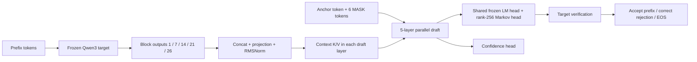

# Qwen3 DSpark

A readable, single-GPU reproduction of the Qwen3 DSpark draft architecture,
with auditable data regeneration, training, and an exact greedy reference verifier.
Based on [NVIDIA NeMo AutoModel](https://docs.nvidia.com/nemo/automodel/recipes-e2e-examples/dspark-speculative-decoding),
pinned to commit `2d365eda1050dd80ee9bd3bfc651e9ae9bbe8c68`.

**Research implementation in progress. No inference speedup has been demonstrated.**
The current verifier recomputes prefixes and is a correctness reference.

## Architecture



Layer indices are zero-based. Draft queries attend to context strictly before
that block's anchor and to every position in their own draft block. Blocks cannot
see one another. The target's final normalized hidden states provide detached
teacher probabilities for training; they are distinct from the five-layer draft
context. Frozen embedding and LM-head parameters are shared in memory.

## Quick start

Install a PyTorch build appropriate to your CUDA/ROCm device first. The tested
GPU environment is PyTorch 2.12.0+rocm7.2 and Transformers 5.17.0.

```bash
python -m pip install -e '.[data]'
OMP_NUM_THREADS=2 python -m unittest discover -s tests -v
cp configs/pilot.example.json configs/pilot.local.json
cp configs/train-pilot.example.json configs/train-pilot.local.json
```

Download Qwen3-0.6B separately and set `model` to its local directory in both
configs. Set data and output paths for your machine. Model and dataset licenses
remain applicable; neither weights nor generated examples are included here.
The pinned source dataset shard identity is in [references/source.json](references/source.json).

```bash
python scripts/prepare.py --config configs/pilot.local.json \
  --parquet /path/to/train-00000-of-00006.parquet --output data/pilot/input
python scripts/generate.py --config configs/pilot.local.json \
  --prompts data/pilot/input/prompts.jsonl --output data/pilot/generated
python scripts/audit.py --run data/pilot
python -m dspark_qwen.train --config configs/train-pilot.local.json
python -m dspark_qwen.eval_decode --checkpoint runs/train-pilot/step-000008 \
  --examples 2 --max-new-tokens 24
```

Generation resumes complete batches with identical inputs/config/runtime. Training
supports `--stop-after N` followed by `--resume`; source, configuration, model,
data and runtime identities must match. Use a new directory for a new experiment.
Checkpoint optimizer files must come from a trusted local run.

## Evidence and limits

The [initial execution experiment](reports/pilot-20261008/README.md) used 49 training
and 7 held-out completed responses. Eight optimizer steps with a process restart
verified the training/checkpoint path. Eight CPU tests covered mask parity with
NeMo, information isolation, gradients, exact optimizer resume and greedy branches.
Two real prompts produced 30 tokens identical to target-only greedy, with **zero
accepted draft tokens**. These are execution/correctness checks, not quality or
performance results.

The five-layer draft has 161,692,161 trainable parameters. Training uses single
unpadded sequences, dense SDPA, FP32 trainables and BF16 autocast. Four anchors and
two accumulation microsteps keep the pilot small; this is not paper-scale training.
The local checkpoint format is not directly compatible with NeMo, vLLM or SGLang.

Next milestones and the criteria for claiming progress are in [the experiment
plan](docs/experiment-plan.md). KV-cache management, stochastic rejection sampling,
dynamic verification and hardware-aware scheduling remain to be implemented.

## Experiment journal

[实验复盘日志](docs/lab-notebook.md)记录问题、假设、处理方法、验证结果、
失败尝试和下一步决策，并关联提交与证据。历史结果与进行中的实验分开标注。

## Code map

| Module | Responsibility |
| --- | --- |
| `target.py`, `model.py` | Frozen target capture, draft attention and heads |
| `losses.py`, `data.py` | CE/L1/confidence supervision and exact token alignment |
| `train.py`, `checkpoint.py` | Training, evaluation, state and identity checks |
| `decode.py`, `eval_decode.py` | Reference greedy verification and exact comparison |
| `scripts/` | Prompt selection, target regeneration and data auditing |
| `tests/` | Tensor-level correctness and regression checks |

Development instructions: [README.ai.md](README.ai.md). Apache-2.0;
[third-party attribution](THIRD_PARTY_NOTICES.md).
